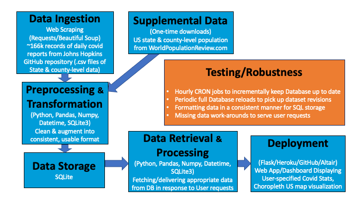
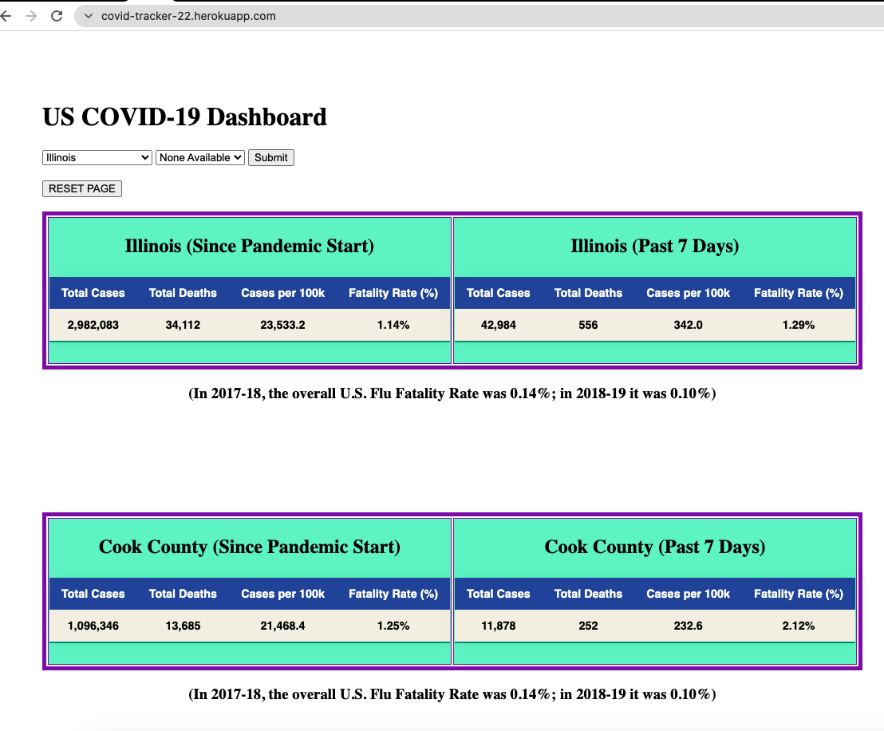
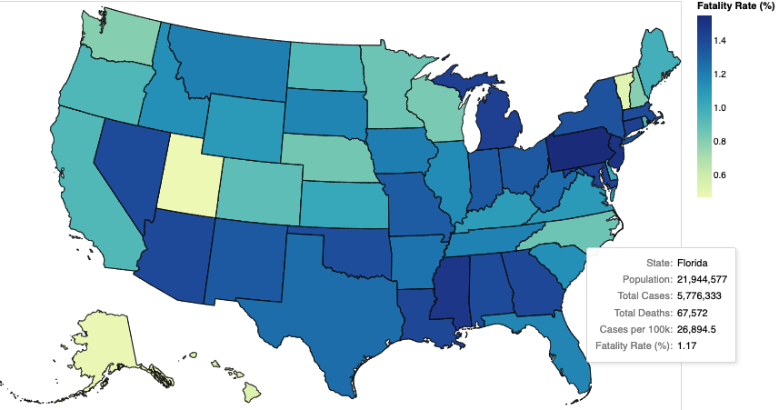

# Minimum Viable Product

#### A USER-CONFIGURABLE WEB-BASED COVID-19 CASE AND DEATH RATE DASHBOARD FOR THE U.S.

A simple, easily understandable web-based dashboard is currently under development to provide useful COVID-19 information for a given US-based state and major county. It makes use of the Johns Hopkins CSSE COVID-19 data repository (https://github.com/CSSEGISandData/COVID-19/tree/master/csse_covid_19_data), which has been updated with new .csv files documenting the state-level (including Washington, DC) and county-level cumulative COVID case data for the United States on a daily basis since 12 April 2020.  The dashboard also makes use of supplemental data (via one-time download from https://worldpopulationreview.com/) consisting of 2021 population data for each state and county of interest. (The population data for the 200 largest US counties will be included in this project, with potentially more added later if time permits.)

The data pipeline for the project has been updated slightly since the proposal phase to include data visualization via a choropleth map using Altair. This added feature is still under development.  The revised data pipeline diagram appears below:

A working version of the original proposed dashboard (without any visualizations) was successfully deployed and has been continuously operational on Heroku for several days already (with daily database updates pushed to GitHub), as indicated by the following screenshot:

The plan forward is to incorporate a US choropleth map in the dashboard with user-selectable options to focus on any of the quantities of interest from the tablular view. A notional version of this feature with color set to reflect the statistic "Fatality Rate (%)" (Since Pandemic Start) is shown in the following figure. (Note the hover-over tooltip which shows total population and all four statistics from the tabular view for a given state.):

The frontend interface to allow users to select the parameter of interest in the choropleth map has yet to be developed, but it will most likely consist of a pair of radio button sets: One set to toggle between the "Since Pandemic Start" and "Past 7 Days" data, and the other set to select one of the four statistics of interest ("Total Cases", "Total Deaths", "Cases per 100k", or "Fatality Rate (%)") as map's the color basis.
