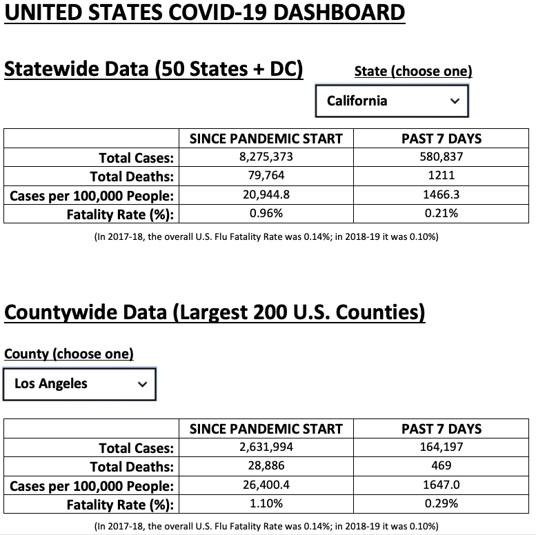
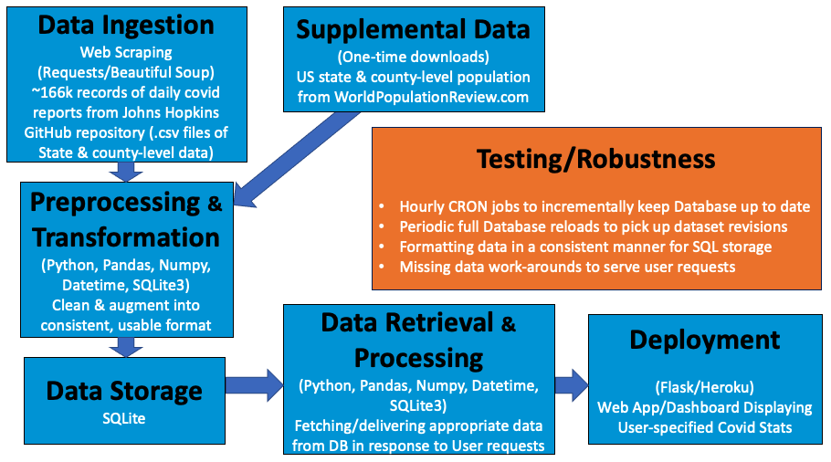

# PROJECT PROPOSAL

##### A USER-CONFIGURABLE WEB-BASED COVID-19 CASE AND DEATH RATE DASHBOARD FOR THE US

Since the early days of the COVID-19 pandemic, Johns Hopkins Center for Systems Science and Engineering (CSSE) has provided the public a free dashboard of cases and deaths (see https://coronavirus.jhu.edu/map.html). Updated daily, this dashboard has included more and more information on the pandemic worldwide over time. As a result, getting basic, easily digestible COVID-19 information for a specific US location has become somewhat overwhelming for the average dashboard user.

The intent of this project is to provide an alternative web-based dashboard where a user can get just the most basic, useful information for a given US-based state and major county without being flooded with excessive data and visualizations. A notional idea of the proposed user interface for this system appears below:

The dataset for this project comes from the Johns Hopkins CSSE COVID-19 data repository (https://github.com/CSSEGISandData/COVID-19/tree/master/csse_covid_19_data), which has been augmented with new .csv files documenting the state-level (including Washington, DC) and county-level cumulative COVID case data for the United States on a daily basis since 12 April 2020. (Earlier subsets of data were also provided, but the project will only make use of the data from 12 April 2020 onwards, since that marks the beginning of a complete daily national snapshot of COVID data).

Supplemental data (via one-time download from https://worldpopulationreview.com/) consists of 2021 population data for each state and county of interest. (The 200 largest US counties will be included in this project, with potentially more added later as time permits.)

The proposed data pipeline for the project is shown in the following diagram:

As stored in the SQLite database for use in the web application, an individual unit of state-level data has the following characteristics:

- Province_State (TEXT)          :  Name of US State or 'District of Columbia'
- Date (DATE)                          :  Date covered by this data (format 'yyyy-mm-dd')
- Lat (REAL)                             :  Latitude for a map representation of the associated state
- Long_ (REAL)                        :  Longitude for a map representation of the associated state
- Confirmed (INTEGER)           :  Cumulative (since start of pandemic) number of active COVID-19 cases for this state and date
- Deaths (INTEGER)                :  Cumulative number of COVID-19 deaths for this state and date
- Incident_Rate (REAL)            :  Cumulative number of COVID-19 cases per 100,000 residents for this state and date
- Case_Fatality_Ratio (REAL)  :  Cumulative rate (%) of COVID-19 deaths for this state and date
- Pop2021 (INTEGER)             :  Official 2021 population of this state (used for "Past 7 Days" Cases per 100,000 People calculation)

And an individual unit of county-level data has the following characteristics:

- Admin2 (TEXT)                      : Name of US county
- Province_State (TEXT)          :  Name of US State or 'District of Columbia'
- Date (DATE)                          :  Date covered by this data (format 'yyyy-mm-dd')
- Lat (REAL)                             :  Latitude for a map representation of the associated county
- Long_ (REAL)                        :  Longitude for a map representation of the associated county
- Confirmed (INTEGER)           :  Cumulative (since start of pandemic) number of active COVID-19 cases for this county and date
- Deaths (INTEGER)                :  Cumulative number of COVID-19 deaths for this county and date
- Incident_Rate (REAL)            :  Cumulative number of COVID-19 cases per 100,000 residents for this county and date
- Case_Fatality_Ratio (REAL)  :  Cumulative rate (%) of COVID-19 deaths for this county and date
- Pop2021 (INTEGER)             :  Official 2021 population of this county (used in "Past 7 Days" Cases per 100,000 People calculation)

As indicated by the notional user inerface and proposed data processing pipeline shown above, the web application will respond to user selections (state and county of interest) by fetching the appropriate data from the SQLite database, performing the necessary "Past 7 Days" Cases per 100,000 People calculations, and displaying the requested results in the dashboard. As the timing of Johns Hopkins CSSE daily data drops cannot be predicted with certainty, a CRON job will check their GitHub repository hourly and incrementally update the SQLite database with new daily data as it becomes available.

Moreover, since Johns Hopkins CSSE periodically revises past data drops,  a different CRON job will periodically (probably 2-3 times per week) do a full database reload using the most recent version of the complete dataset. Data value checks and formatting will be performed on all incoming data to ensure consistency prior to database storage. And the user data retrieval process will include the ability to gracefully handle any potentially missing dates (due to a failure of Hopkins CSSE to provide a given day's data) and still serve all valid user requests. (For example, if the data from 7 days ago is not available, the data from 8 days ago will be used instead, and if that is unavailable, the data from 6 days ago will be used, and so on.)

The tools required for this project are: 

1. Pandas, Numpy and Datetime to explore, clean, transform, load, query and quality check data used by the web application
2. Requests and Beautiful Soup to scrape the Hopkins CSSE data repositories and access the datasets
3. SQLite to store the full user-ready dataset serving the web application
4. Python 3.8 (to be able to use all of the above)
4. CRON jobs to gather data from the Hopkins CSSE repository, update the SQLite database, and push the latest database to GitHub (where it can be accessed by the web application)
4. Flask/Heroku (or possibly Streamlit) to implement and host the web application

The Minimum Viable Product for this project will be a working web application delivering the user functionality suggested by the notional user interface shown above.

